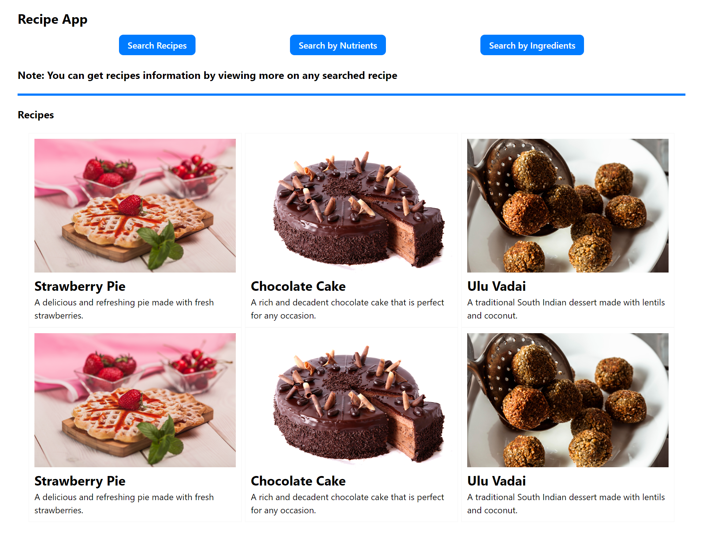

## Table of contents

- [RECIPE APP](#RecipeApp)
  - [Screenshot](#screenshot)
  - [Links](#links)
- [My process](#my-process)
  - [Built with](#built-with)
  - [Useful resources](#useful-resources)
- [Author](#author)

### RECIPE APP

Users should be able to:

- View the optimal layout for the site depending on their device's screen size
- Route to different pages on the website.

### Screenshot

<!--  -->

### Links

<!-- - Solution URL: [https://github.com/Dexie14/RecipeApp.git](https://github.com/Dexie14/RecipeApp.git) -->

## My process

........🥶😱😰😢😔😓😴🤔🤗😊😋😎

### Built with

- React
- Semantic JSX markup
- CSS modules
- FlexboX
- Axios
- react hooks

### Useful resources

- [spoonacular](https://spoonacular.com/food-api/docs/) - The API documentation used for thr mini project

## Author

- Github - [@Dexie14](https://github.com/Dexie14)
- Twitter - [@adeluadeoniye14](https://www.twitter.com/adeluadeoniye14)
- LinkedIn - [@adelu-adeoniye](https://www.linkedin.com/in/adelu-adeoniye/)

